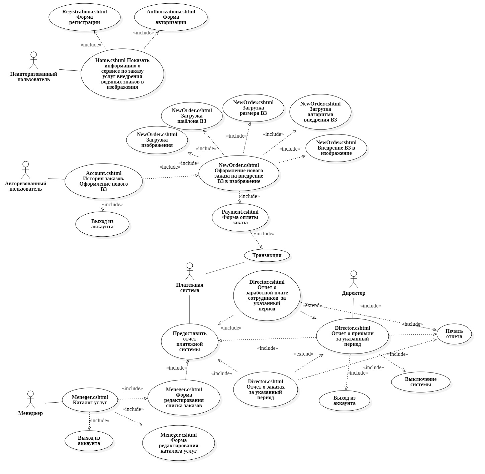

# Объектно-Ориентированные Технологии Программирования и Стандарты Проектирования (Лабораторные работы)
### 1. Use Case диаграмма (ЛР №1)

  

### 2. Deployment диаграмма (ЛР №2)

  

### 3. Statechart диаграмма (ЛР №3)

  

### 4. Activity диаграмма (ЛР №4)

  

### 5. Sequence диаграммы (ЛР №5)

  
  
  
  
  
  
  

### 6. Component диаграмма (ЛР №5)

  

