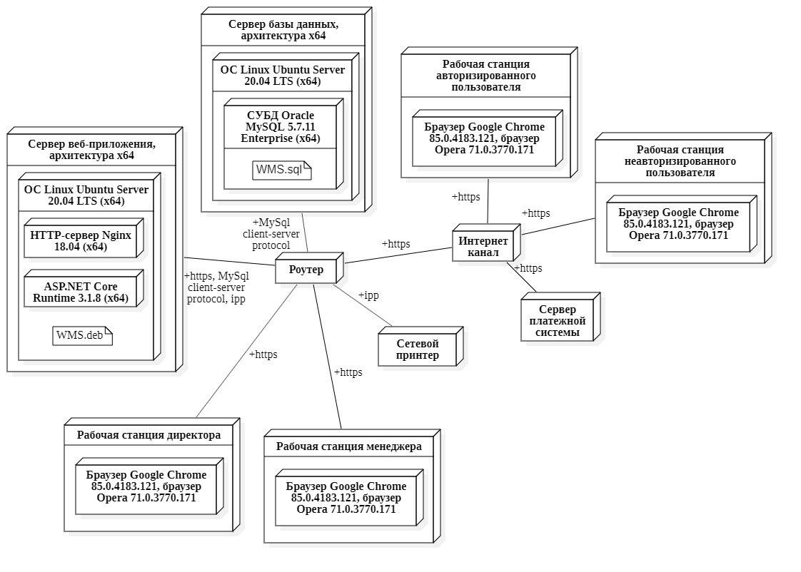

# Объектно-Ориентированные Технологии Программирования и Стандарты Проектирования (Лабораторные работы)
### 1. Use Case диаграмма (ЛР №1)

  

### 2. Диаграмма Deployment (ЛР №2)

  

### 2. Statechart Диаграмма (ЛР №3)

  

